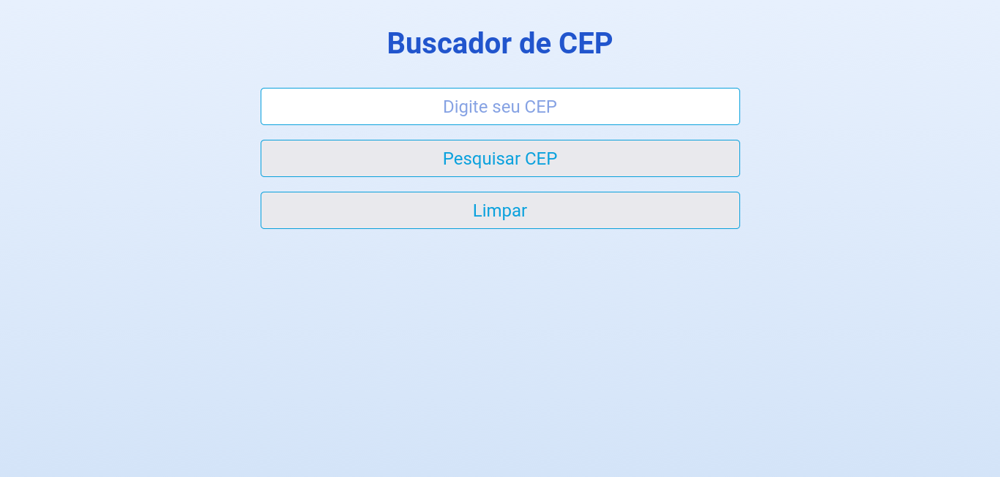

# Buscador de CEP

## Sobre o projeto

Esse projeto foi criado para colocar em prática os conhecimentos adquiridos na jornada de aprenziado do <b>#TransformaTec</b>, programa de formação Full Stack da <b>Digital Innovation One<b>.

O objetivo do projeto é consumir uma API, no caso da via cep. Foram utilizados <b>HTML<b>, <b>CSS<b> de maneira bem simples, o foco maior do projeto está no <b>JavaScript<b>, onde a API é consumida de forma bem simples.

### Screenshot

## Author

- Github - [fagundesraphael](https://github.com/fagundesraphael)
- Frontend Mentor - [@fagundesraphael](https://www.frontendmentor.io/profile/fagundesraphael)
- Twitter - [@fagundesraphael](https://www.twitter.com/nuncaestou)
- LinkedIn - [@fagundesraphael](https://www.linkedin.com/in/fagundesraphael/)
